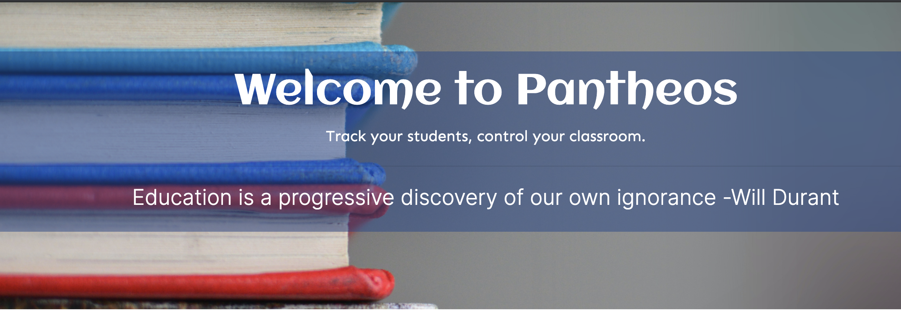

# Pantheos

## Table of Contents
[Description](#description) 
[Dependencies](#dependencies) 
[Authors](#authors)   
[Future Development](#development)  
[Links](#links) 
[Demo]("#demo") 
## Description
We wanted to create an app that help make the daily lives of teachers more efficient.

Many educational apps and websites are created for schools, not teachers. Therefore, they are jumbled with links and buttons that are irrelevant to teachers making it harder and more time consuming to find the information they need. When you have a class of 30 energetic middle schoolers, any extra few seconds your attention is on your computer can cause you to lose control of your classroom.

The student information tracker for teachers to streamline communication and reports of students records. With class sizes growing and teachers being asked to take on more and more students and responsibilities each year, the technology/resources offered to them seems to be one step behind. Pantheos offers teachers an easy to access student database to track a variety of information of all students in the school. With a user friendly website interface, teachers have the ability to remotely track/add/delete students at their fingertips. 

## Dependencies
This app uses lodash, mysql2, sequelize, express, and handlebars.

## Authors
Allana Anderson
Thomas Hoyt
Kimberly Owens
Preston Patterson

## Development
In future development of this app, we would like to add more tables to the database including student's scores, schedules, and a detention table that allows the teacher to input more information about a student's detention status. With the student's scores, we would like to add charts to show the student's grade progression over time. We would also like to add in the ability to update and delete teachers. 

One of the biggest future updates is adding a student and parent side to the app so that they can see the student's grades, schedule, and detention status as well. Along with this update we would like to add a parent-teacher communication portal and authentication for administrators, teachers, and parents.
## Links
[Pantheos](https://murmuring-headland-14646.herokuapp.com/)
## Demo

